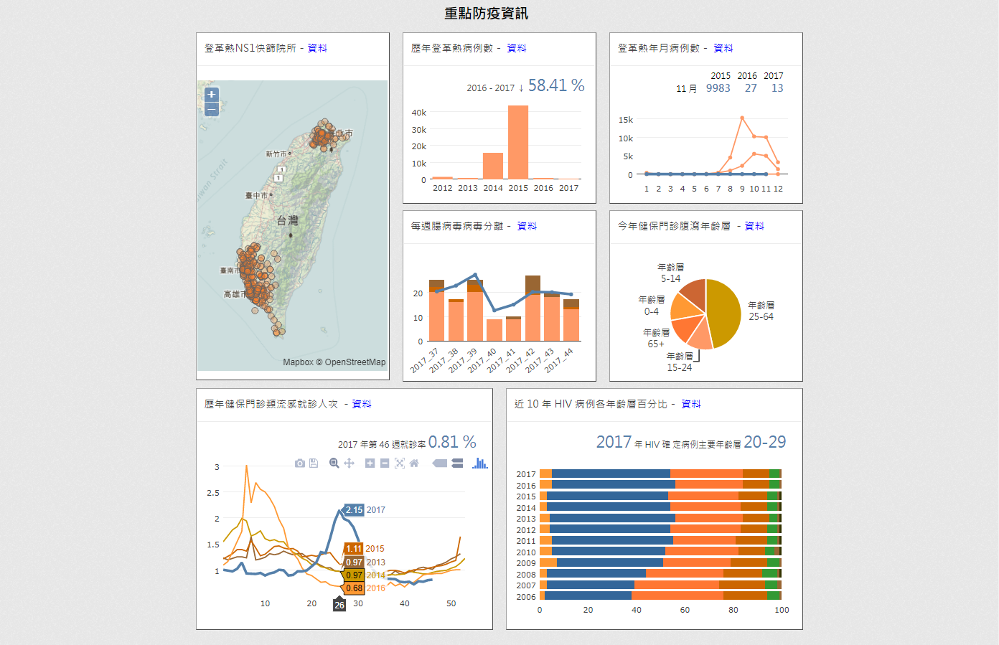

.. image:: https://travis-ci.org/jiankaiwang/ckanext-cdccushomepage.svg?branch=master
    :target: https://travis-ci.org/jiankaiwang/ckanext-cdccushomepage

=============
ckanext-cdccushomepage
=============

The ckanext implements the interactive charts for public health data on the homepage. There are seven charts shown, including **Dengue NS1 Rapid Screening**, **Yearly Dengue Cases**, **Monthly Dengue Cases**, **Entrovirus Specimen**, **Diarrhea Outpatients**, **Out-patient Clinicis for Influenza**, and **Percentage of HIV Age Group**.

------------
Requirements
------------

* Developed on CKAN 2.5.x
* ckanext-cdcmainlib : https://github.com/jiankaiwang/ckanext-cdcmainlib

-----------
Preparation
-----------

1. Open the fanstatic/general.js, and edit the api link, for example::

   dengueYearCountData('https://od.cdc.gov.tw/opendataplatform/?s=dengue&v=a1');
   diarrheaPieData('https://od.cdc.gov.tw/opendataplatform/?s=diarrheapiechart&v=a1');
   influLCBody("https://od.cdc.gov.tw/opendataplatform/?s=influlinechart&v=a1");
   dengueLineChartBody('https://od.cdc.gov.tw/opendataplatform/?s=dengue&v=a2');
   entrovirusLBCBody('https://od.cdc.gov.tw/opendataplatform/?s=enterovirus&v=a1');
   hivBCDraw('https://od.cdc.gov.tw/opendataplatform/?s=hivbc&v=a1');

2. Edit the fanstatic/combine.sh, and export the combined javascript (combined.js).
   While you edit the single javascript, it is necessary to combine all the script into one 
   because ckan might import scripts in the wrong order.
   For example::

   # Notice the sequential script in variable catJS.
   vim ckanext/cdccushomepage/fanstatic/combine.sh
   sh ckanext/cdccushomepage/fanstatic/combine.sh

3. Open ckanext/cdccushomepage/templates/home/snippets/denguens1.html, edit the iframe src, for example::

   <iframe class="iframe-container-ns1" src="http://localhost:12080/dataset/denguens1map/resource/b7b93f4d-35f7-4630-94c8-6efcb9aa62e3/view/4943d2ee-e24b-47b7-b9e5-4e6b72a01e0e" frameBorder="0" scrolling="no"></iframe>

4. Edit the meta data on ckanext/cdccushomepage/templates/base.html, for example::

   <meta property="og:title" content="疾病管制署資料開放平台" />
   <meta property="og:url" content="http://localhost:12080/" />
   <meta property="og:type" content="website" />
   <meta property="og:description" content="透過互動式圖表、地圖與儀表板讓您了解公開資料價值。" />
   <meta property="og:image" content="http://localhost:12080/nasa_taiwan_black.jpg" />
   <meta property="og:image:secure_url" content="http://localhost:12080/nasa_taiwan_black.jpg" />
   <meta property="og:image:type" content="image/png" />
   <meta property="og:image:width" content="1420" />
   <meta property="og:image:height" content="1016" />

------------
Installation
------------

To install ckanext-cdccushomepage:

1. Activate your CKAN virtual environment, for example::

     . /usr/lib/ckan/default/bin/activate

2. Clone the ckanext-cdccushomepage from github, for example::

     cd /usr/lib/ckan/default/src/
     git clone https://github.com/jiankaiwang/ckanext-cdccushomepage.git

3. Install the ckanext-cdccushomepage Python package into your virtual environment::

     cd /usr/lib/ckan/default/src/ckanext-cdccushomepage
     pip install .

4. Add ``cdccushomepage`` to the ``ckan.plugins`` setting in your CKAN
   config file (by default the config file is located at
   ``/etc/ckan/default/production.ini``).

5. Restart CKAN. For example if you've deployed CKAN with Apache on Ubuntu::

     sudo service apache2 reload

   If you've deployed CKAN with uwsgi::

     uwsgi --ini-paste /etc/ckan/default/production.ini

   If you've create a ckan.service::

     sudo systemctl restart ckan.service

---------------
Config Settings
---------------

Make sure adding cdctondc to the ckan.plugins. For example::

   ckan.plugins = cdctondc

------------------------
Development Installation
------------------------

To install ckanext-cdccushomepage for development, activate your CKAN virtualenv and
do::

    git clone https://github.com/jiankaiwang/ckanext-cdccushomepage.git
    cd ckanext-cdccushomepage
    python setup.py develop
    pip install -r dev-requirements.txt

----------------------------------------
Releasing a New Version of ckanext-cdccushomepage
----------------------------------------

ckanext-cdccushomepage is availabe on PyPI as https://pypi.python.org/pypi/ckanext-cdccushomepage.
To publish a new version to PyPI follow these steps:

1. Update the version number in the ``setup.py`` file.
   See `PEP 440 <http://legacy.python.org/dev/peps/pep-0440/#public-version-identifiers>`_
   for how to choose version numbers.

2. Create a source distribution of the new version::

     python setup.py sdist

3. Upload the source distribution to PyPI::

     python setup.py sdist upload

4. Tag the new release of the project on GitHub with the version number from
   the ``setup.py`` file. For example if the version number in ``setup.py`` is
   0.0.2 then do::

       git tag 0.0.2
       git push --tags
